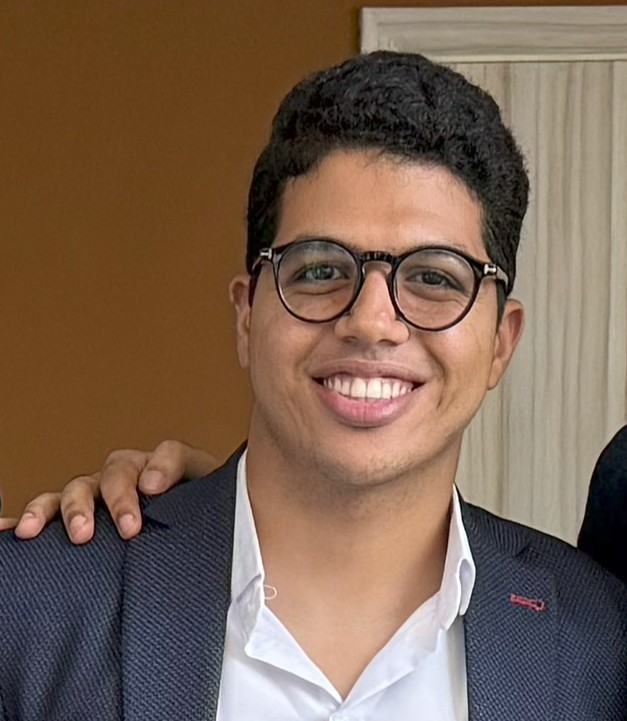

# Hossam Hassan | Full Stack Developer Portfolio

Welcome to my personal portfolio website — a showcase of my technical skills, real-world projects, and professional experience as a Full Stack Developer with a focus on Python and Django.

---

##  About Me

I'm **Hossam Hassan**, a passionate Full Stack Developer specializing in **Python (Django/Flask)**, **JavaScript (React.js)**, and modern web technologies. I love building performant, scalable, and visually appealing web applications that solve real-world problems.

---

## 🛠 Tech Stack

- **Frontend**: HTML, CSS, JavaScript, React.js, Bootstrap, TailwindCSS
- **Backend**: Python, Django, Flask, REST APIs
- **Database**: PostgreSQL, MySQL, SQLite, Django ORM
- **Tools**: Git, GitHub, VS Code, Postman
- **Other**: EmailJS, Deployment via GitHub Pages, Responsive Design, SPA Architecture

---

## 🌐 Live Demo

📍 [View Portfolio Website](https://hossamkoky599.github.io/Portfolio)
